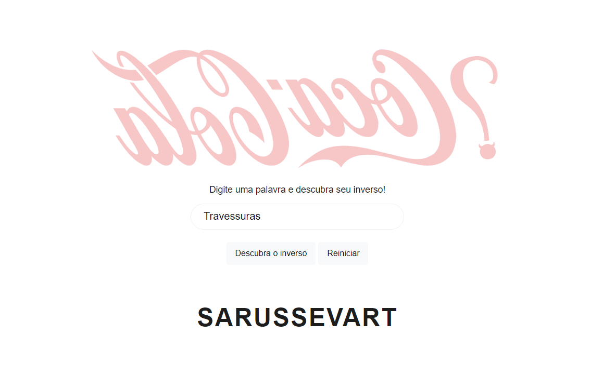

<h1 align="center"> Reverse String Challenge </h1>

Challenge solved for a job selection process.

  <a href="#-the-challenge">The challenge</a>&nbsp;&nbsp;&nbsp;|&nbsp;&nbsp;&nbsp;
  <a href="#-learning-goals">Learning goals</a>&nbsp;&nbsp;&nbsp;|&nbsp;&nbsp;&nbsp;
  <a href="#-technologies">Technologies</a>&nbsp;&nbsp;&nbsp;|&nbsp;&nbsp;&nbsp;
  <a href="#-project">Project</a>

  <a href="#-deploy">Deploy</a>&nbsp;&nbsp;&nbsp;|&nbsp;&nbsp;&nbsp;
  <a href="#%EF%B8%8F-i-learned">Learned</a>&nbsp;&nbsp;&nbsp;|&nbsp;&nbsp;&nbsp;
  <a href="#%EF%B8%8F-author">Author</a>

  

 

  

 

## 🏆 The challenge
The challenge was to build an algorithm to reverse a string without using language built-in functions.

Users should be able to:

- View the optimal layout depending on their device's screen size
- Reveal the reverse characters of their input.

 

## 🎯 Learning goals

Solve this puzzle by manipulating arrays.

 

## 🚀 Technologies

This project was built using following technologies:

- HTML
- CSS
- JavaScript
- GIT

 

## 💻 Project

I solved this challenge by manipulating the string as an array and using a decrementing for to get the string's end and rewrite its content in a new variable.
The Figma layout can be accessed by [THIS]() link.

 

## 🌎 Deploy
Live Site URL: [alodiabo-qm.vercel.app](https://alodiabo-qm.vercel.app/)
 
Figma Layout: [Figma](https://www.figma.com/proto/6rpa2R3fbfIAmfdh0QM49O/alodiabo?node-id=0%3A1) (You'll need a Figma account)

 

## ✔️ I learned

How to manipulate strings as an Array with JavaScript.

 

## 🦸🏾‍♂️ Author

- LinkedIn: [linkedin.com/in/tascintra](https://www.linkedin.com/in/tascintra/)
- Frontend Mentor: [frontendmentor.io/profile/tascintra](https://www.frontendmentor.io/profile/tascintra)

---

#### :memo: License

This project is under a MIT license.
